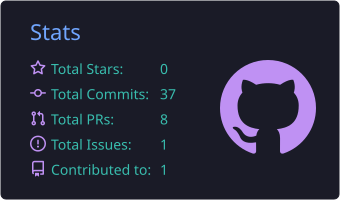
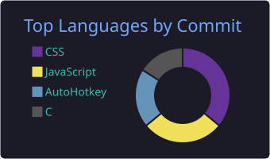

<h1 align="center">Hi there, I'm Nishit 👋</h1>
<h3 align="center">I love automating tasks and building cool software!</h3>

  

---

### 👨‍💻 About Me

- 🔭 I’m currently working on **Web Development & Automation Scripts**
- 🌱 I’m constantly learning and building new tools to make life easier.
- 💬 Ask me about **JavaScript, AutoHotkey, or anything tech-related!**
- 📫 How to reach me: You can explore my repositories to see what I'm up to.

---

### 🛠️ Languages and Tools

  
  
  
  
  

---

### 📊 GitHub Stats

  
  

